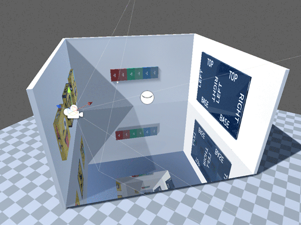

## PLANS

## TO DO

- Invesitage Deferred Rendering Pipeline Support.
- Blended OBB Probe support. 
- Determine best approach for using multiple OBB probes in a scene.
- Determine best approach for mixing AABB and OBB probes in a scene.

- On Bake - refresh all renderers?
- How to deal with static batched models? 
   
   

## CHALLENGES

**Deferred Rendering Pipeline**

Currently there is partial support for a single OBB Probe in the scene, but its imperfect as Unity clips the OBB by the original probe AABB!

It looks as though deferred is rendering the reflection via use of a volume ( cube ) and that cube is using the original probe AABB. However so far i've been unable to alter this even at the vertex shader level so there must be something more going on.
   
   
**Blended OBB Probe Support**

Tricky to blend OBB with AABB as we have to branch depending upon which input cube is which type of probe.

Perhaps the simplest approach is to simply treat every OBB renderer ( as defined by its material using the Standard OBB Projection Shader ) probe inputs as OBB, even if one or more are actually just AABB. This would put onus on the developer to ensure probes are correctly set up to be AABB or OBB.

Is ther any  way to tie into Unity's ReflectionProbe component?
   
   

** Static Batched Models**
Seems to work fine with static batching but suspect we might be pushing far more Set materialPropertyBlocks than needed. Since all of the meshes have been combined we should only need to update a single renderer - but we don't have access to it.
   
   

## IMPROVEMENTS

**UNITY_STANDARD_SIMPLE**

If this is still used it looks like we could calcualte probeLocalPosition and probeLocalReflUVW in the vertex shader. 
This would be more efficient as its per-vertex instead of per-pixel.

**General**
Automatically switch shaders for renderers affected by probe? Maybe editor only?
Can we make use of CBUFFER_START? There is already one for ReflectionProbes, but that might not be suitable for dynamic probes that update every frame.
   
   

## IDEAS

**Custom Reflection Probe Component**

Instead of relying on Unity's Reflection Probe component make our own?
Somehow Unity Reflection Probe is based just on Behaviour not MonoBehaviour?

**Exension Methods**

What if there was a way to use an exension method on ReflectionProbe to fetch the WorldToLocal matrix for an OBB Probe? 
Perhaps it could return a MaterialPropertyBlock?

- Ideally we want it to not allocate memory so maybe use static MPB, Matrix, etc
- Can we cache values and only update if
	- forced
	- new frame
	- Probe is not baked

It will still require every renderer that wants to use OBB to call this method, either on 
- Awake	( baked - will work as long as probe not changed in editor )
- OnEnable ( baked - will work iin editor as it often gets called? )
- OnWillRenderObject ( for realtime - called every frame )
   
   

## NOTES

**General**
MaterialPropertyBlock is not serialized - so must be recreated on load.
OnAfterAssemblyReload does not appear to be called until AFTER Awake and OnEnable!

**Reflection Probe** 
WorldToLocal Matrix - must be calculated on demand as a renderer may request it at any time.
It can be cahed as it only changes when
- Reflection Probe dimensions changes
- Reflection Probe transform changes.

**Renderers** 
Request probe WorldToLocal in;
- Awake	( baked - will work as long as probe not changed in editor )
- OnEnable ( baked - will work in editor as it often gets called? )
- OnWillRenderObject ( for realtime - called every frame )

In theory all we need to do is store the matrix with the renderer and assign it during start.
Question is how might this break in builds. How to efficeintly pass the matrix as a MPB ( static myaybe )