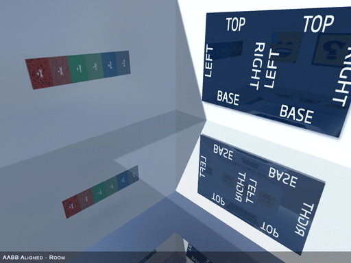
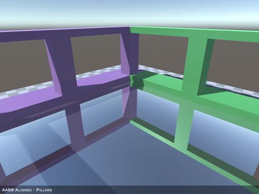

## Unity OBB Reflection Probe Support

## Introduction

This package adds basic support for oriented bounding box projection to Unity **Built-in Rendering Pipeline**.

#### Supported

- Forward and Legacy Deffered.
- Single oriented bounding box - unsure what happens if you mix multiple AABB probes with one OBB.
- Simple mode - no blended probes.

#### Not Supported

- Deferred - partial support.
- Blended Probes - no support at all - not sure what happens - best to set up renderers to use simple mode.
   
   

## Information

Currently only supports a single oriented bounding box and whilst it could be extended to support several using the same strategy, doing it correctly is a far more complex task.

The project uses shader globals to pass the required matrix to a custom Standard shader. Any materials that use this shader can then take advantage of OBB projection instead of AABB projection that Unity offers. 

In the future I want to take another look into this and see if there is a better method to achieve this objective, streamlining its use and supporting multiple OBB reflection probes. It should be possible to tap into the renderers closest probe method and assigning the probe matrix directly to that renderers instace/renderblock.

Deferred is partially implemented, but looks like the reflection is rendered into the gbuffer via a cube mesh to define volume and that is still based on old axis aligned. This means for a roated square room the corners get cut-off. Haven't been able to figure out where in the render chain this is occuring yet.
   
   
### Prerequisites
#### Unity 2019.4

This package is in development, and requires Unity 2019.4.
   
   
## Getting Started
The code and shaders come in as an embedded package found in the Packages folder. Simply copy the 'com.noisecrimestudios.obbreflectionprobe' folder from the repository packages folder to your own projects packages folder.

To use OBB Reflection you must add the OBBReflectionProbe component to your Reflection Probe gameObject. If you make changes to the Probe you should click the 'Update Shader Global Reflection Matrix' button in this component.

For materials to perform OBB reflection they must use the supplied 'Standard (RotatedBoxProjection)' shader.

There is a sample supplied which can be installed via the Package Manager that demonstrates the OBB Reflection in the scene, though this scene is mostly set up to allow for testing and debugging. However its a good reference to check how to set up materials, probes and gameobjects to perform OBB reflection.

The sample scene has a gameObject called 'Collections' that allows you to toggle various setups (collections of gameObjects) on/off, again this was for debugging to ensure the correctness of the OBB Reflection shader code.

### Deferred Renderer
For deferred render to work you must replace the Internal-DeferredReflections shader with the custom one. This is done via Project Settings - Graphics - Deferred Reflections.
However spport is only partially implemented currently. Whilst the reflection is correctly rendered parts of it get cut-off.

